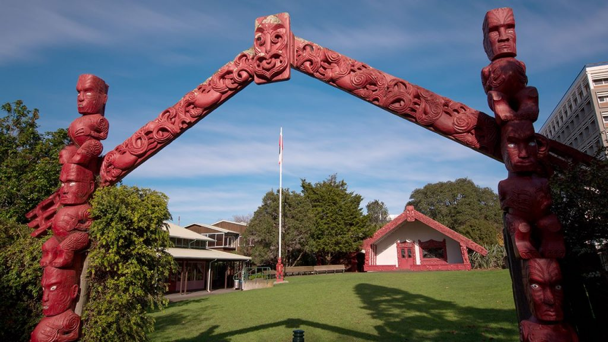

## About the previous Data and Computing Noho run in 2024

The Data and Computing Noho marae is aimed at strengthening our knowledge of these areas and our Tuākana ties. We will achieve this through kōrero, wānaga, and kai as we stay together at Waipapa marae on the City Campus.

People are welcome from all skill levels and all levels of study from 100- to 700-level across the Faculty of Science or Software Engineering.

The noho is a fully catered and free event, with accommodation at the marae.

Generous support for this event comes from the School of Computer Science.

It is based on similar events that [ran in 2021](./2021hackanoho), and [in 2023](./2023dataandcomputingnoho).

## Location

The Data and Computing Noho will be held at University of Auckland's [Waipapa marae](https://www.auckland.ac.nz/en/on-campus/life-on-campus/maori-life-on-campus/waipapa-marae.html) on the City campus. The marae is [on the corner of Wynyard St and Alten Rd](https://maps.app.goo.gl/mL4jPRfFMWKmPtHm6). 

## Dates and times

The Noho will run from 6pm Friday 22 March, to 1pm Sunday 24 March.

## Gift voucher for attendees

Students who attend the large part of the noho will be be given a $250 gift voucher. Either Countdown or Westfield vouchers are available. These will be sent out in the week following the noho. 

The purpose of this voucher is to encourage and support attendance. 

## Manuhiri 

As well as past and present Tuākana tutors and coordinators from Computer Science, and the Faculty of Science Kaiarahi, we will have experts from industry at the noho including from:

* [Dragonfly Data Science](https://www.dragonfly.co.nz/) - here are [Henry's slides](https://docs.google.com/presentation/d/1lnCdGjX2UE5w9WyCivzLGqhZPZ_0YnafLOiNl0lBm78/edit)
* [The TechNesians](https://technesianlivestream.github.io/)
* Mercury Energy
* Amazon Web Services 
* [The ICT graduate school](https://www.auckland.ac.nz/en/science/business-and-community-engagement/business-and-community/auckland-ict-graduate-school.html)

## Programme

The flow of the day will be guided by people's interests and what is working best. The main fixed times will be meal times but a rough outline is given below.

**Friday** 

* Meet at Waipapa marae at 6pm
* Powhiri
* 7pm Kai
* 8:30pm- Mihimihi (introductions), overview of noho, and discussion

**Saturday**

* Breakfast 8-9am
* In the morning sessions, guests will discuss an interesting current project, with plenty of time for questions and discussion
* About 12:30 Lunch
* The afternoon sessions will be based more around useful skills for working in tech or with data.
* 7pm More kai

**Sunday**

* Breakfast
* Sunday morning will be time to wrap up some discussion, reflect on what we have learned, and think about how we can carry on our work outside of this wananga. 
* Tidy up of whare nui and whare kai.
* 1pm finish

## Possible projects for discussion

At the last noho, we came up with  a list of possible projects people may want to look at or discuss. If any of the below interest you or you have your own project, 

* Create a website on health and technology based on Te Whare Tapa Whā principles
* Creating visualisations for the data on Te Reo Maori and other Pacific languages
* Modelling how New Zealand media portray environmental issues
* Creating maps to visualise pollution by region
* Exploring prospects for language survival using mathematical models based on a [recent paper](https://royalsocietypublishing.org/doi/full/10.1098/rsif.2019.0526)
* Working with people from [Papa Reo](https://papareo.nz/) on machine learning applied to Māori and Pacific Languages
* Working to improve the noho concept and delivery

Just to emphasise: these are suggestions only. We will approach questions like these from whatever background we already have and do not expect to "complete" any project in a single weekend.

Some of these ideas have been fleshed out a little with skeleton code provided at <https://github.com/hackanoho/project-ideas>.

## Questions and answers

* Q: What do I need to know to come along?
  * A: Not a whole lot. The noho is aimed at people with all skill levels in the Faculty who have done or are interested in doing any Stats/Comp Sci/ or similar data/programming type courses   
* Q: Do I need to be there the whole time?
  * A: Ideally you'll be there as long as possible. But if you have work or other commitments that mean you can only come for part of it, you can still come along.
* Q: What do I need to bring?
  * A: Accomodation is in the whare nui so bring a sleeping bag and whatever personal items you need. If you have a lap-top or other device, you can bring that too. 
* Q: Can I borrow a laptop?
  * A: Probably. Let us know you need one.  

## Contact

If you have any questions about the event, contact 

* David Welch [david.welch@auckland.ac.nz](mailto:david.welch@auckland.ac.nz) ph [0211354767](tel:+64211453767), or 
* Daniel Wilson [daniel.wilson@auckland.ac.nz](mailto:daniel.wilson@auckland.ac.nz) ph [0210673167](tel:+64210673167)

We look forward to hearing from you and seeing you at the noho!

*view source at <https://github.com/hackanoho/hackanoho.github.io> *