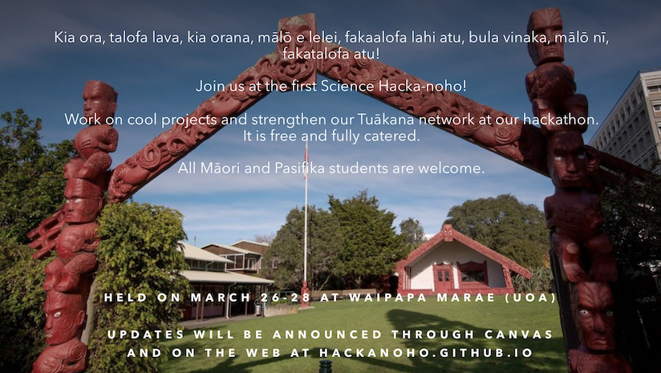

## About

The Hacka-noho is a combined hackathon and noho marae. The aim of it is to strengthen our Tuākana ties by working together on some collaborative projects and staying together at Waipapa marae.

People are welcome from all skill levels and all levels of study from 100- to 700-level.

The Hacka-noho is a fully catered and free event.

Email us if you would like to attend (see Contact below).

[Download flyer as pdf](./hackanohoflyer.pdf "Flyer pdf")

## Location

The Hacka-noho will be held at University of Auckland's [Waipapa Marae](https://www.auckland.ac.nz/en/on-campus/life-on-campus/maori-life-on-campus/waipapa-marae.html) which is at [16 Wynyard St, Auckland 1010](https://goo.gl/maps/ZGcf5QAWceEpJj9N9) just off Altern Road. 

## Dates and times

We will have a powhiri to kick on on the evening of Friday 26 March. The programme runs through until early afternoon of Sunday 28 March.

Accomodation is at the marae.

## Plan

**Friday** 

* Meet at Waipapa at 5:30pm
* Powhiri
* 7pm Kai
* 8:30pm- Mihimihi (introductions), overview of hackanoho, and discussion

**Saturday**

* Breakfast 8-9am
* Most of the day will be for work on projects and discussions in smaller groups.
* About 12:30 Lunch
* 7pm More kai

**Sunday**

* Breakfast
* Sunday morning will be time to finish up and work and present back/discuss with the wider group.
* 1pm finish

## Possible projects

You are free to bring your own project ideas if you have them but we have also come up with a few ideas ourselves. Here's a list:

* Create a website on health and technology based on Te Whare Tapa Whā principles
* Creating visualisations for the data on Te Reo Maori and other Pacific languages
* Modelling how New Zealand media portray environmental issues
* Creating maps to visualise pollution by region
* Using the SMAT (social media analysis tool) API to analyse conspiracy theories on social media
* Exploring prospects for language survival using mathematical models based on a [recent paper](https://royalsocietypublishing.org/doi/full/10.1098/rsif.2019.0526)
* Working with people from [Papa Reo](https://papareo.nz/) on machine learning applied to Māori and Pacific Languages
* Working to improve the hacka-noho concept and delivery

Just to emphasise: these are suggestions only. We will approach questions like these from whatever background we already have and do not expect to "complete" any project in a single weekend.

Some of these ideas have been fleshed out a little with skeleton code provided at https://github.com/hackanoho/project-ideas.

## Questions and answers

* Q: What do I need to know to come along?
  * A: Not a whole lot. The hacka-noho is aimed at people with all skill levels in the Faculty who have done or are doing any Stats or Comp Sci course (or similar data/programming type courses)   
* Q: Do I need to be there the whole time?
  * A: No. If you have work or other commitments that mean you can only come for part of it, you can still come along.
* Q: What do I need to bring?
  * A: Accomodation is in the whare nui so bring a sleeping bag and whatever personal items you need. If you have a lap-top or other device, you can bring that too. 
* Q: Can I borrow a laptop?
  * A: Probably. Let us know you need one.  
* Q: How can I register to attend?
  * A: Just send us an email, see Contact details below

## Contact

If you would like to register to attend or have any questions, contact David Welch [david.welch@auckland.ac.nz](mailto:david.welch@auckland.ac.nz) or Daniel Wilson [daniel.wilson@auckland.ac.nz](mailto:daniel.wilson@auckland.ac.nz)

We look forward to seeing you there!